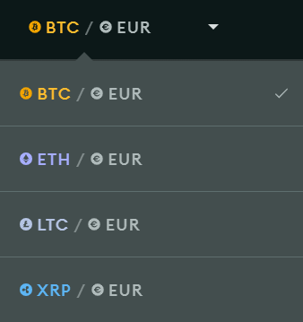

# bsdex Frontend Challenge

Welcome to the bsdex Frontend Coding Challenge. The goal of this assessment is to give us an idea how you approach code related tasks and to get an impression on how you solve problems. If you have any questions before of at any time during this challenge just reach out to the contact person who invited you to take this challenge.

You should not spend more than 4 hours on this challenge in total. We are aware that 4 hours may not be enough for everything but we don't want to take too much of your valuable time, so it is fine to stop after 4 hours as that already gives us a first idea how you prioritize tasks.

## The Challenge

First, please clone this repo into a **private** GitHub repo. If you don't have a GitHub account you can also use GitLab, Bitbucket or any other source control service of your choice.

The repo contains an emptied Create React App setup and a small api mock server for you to work with. You can start both at the same time by running `yarn develop`. The api server will then be accessible on `http://localhost:3030` and is protected via http Basic Auth. The credentials are `bsdex` as username and `challenge` as password. The client application will be running on `http://localhost:3000`. You can optionally use TypeScript but this is _**not** a must_.

Requirements are the following:

- Make an API call to `http://localhost:3030/markets` to get a list of markets to display

  You can use a library or native fetch or XMLHttpRequest. Use whatever you personally prefer and think is easiest.

- Implement a custom dropdown component. The Dropdown should look (roughly) like in the screenshot

  

  It does not have to be pixel perfect but it should look at least similar and contain all the information seen in the screenshot. The currently selected market should be seen on top and once you click it, a list of all the other available markets should appear. Once you select a market from the list, the dropdown should close and the selected market should be stored in some sort of global state. Use the state management tool of your choice. Can be Redux, MobX, Recoil or just React itself. You decide!

- Style it using a technique of your choice (can be plain css, CSS Modules, Sass, styled-components or whatever you like most)

- Once the value has changed, make a request to the `/prices` endpoint to get a list of prices. Find the currently selected market from the list and display it. The result should be something like:

  ```
  Bitcoin (8418 Euro)
  ```

- Write a tests for the Dropdown's functionality

  Again, use whatever you like. Jest as a testrunner already comes with Create React App but everything else you can decide on your own. Use Enzyme, Testing Library or any other testing framework of your choice.

Once you're done with everything push the result to your git repo and invite us to have a look. Thank you for your time!
